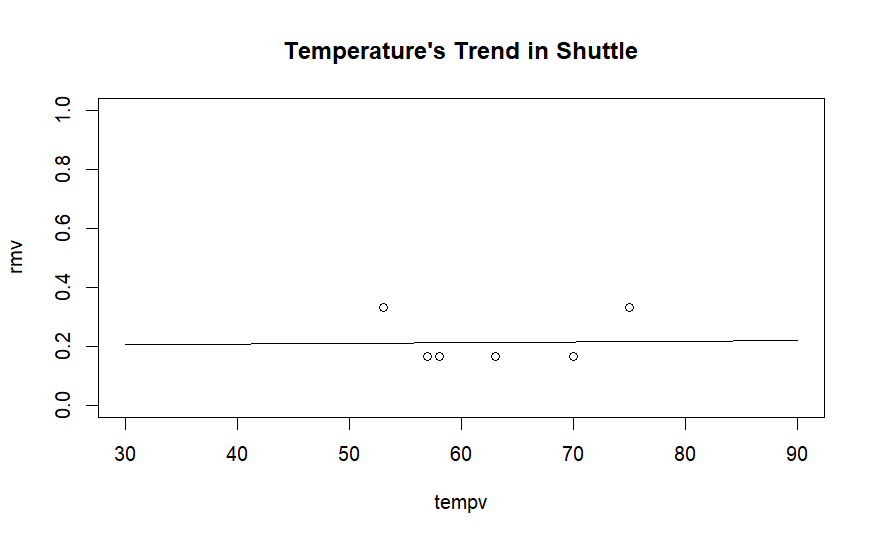
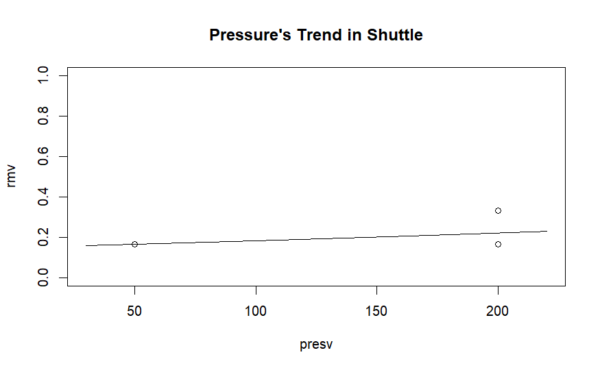

# Analysis

Based on the dataset, there are information about Temperature, Pressure, and also Malfunction. In their analysis, they only care about the temperature. They didn't really care about the Pressure in their analysis. But, based on what I analyze, the Pressure affect more than the Temperature. The higher the Pressure, the higher the probabilty for it to malfunction. It also the same case for the temperature, but it has the lower trend.

So based on these analysis, it might have a big probability that the shuttle was running in the high pressure and make it malfunction.
